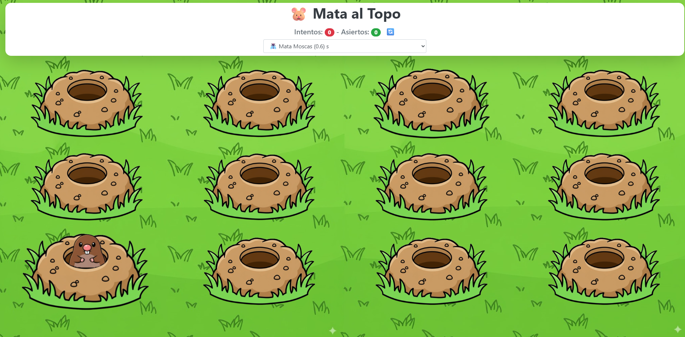
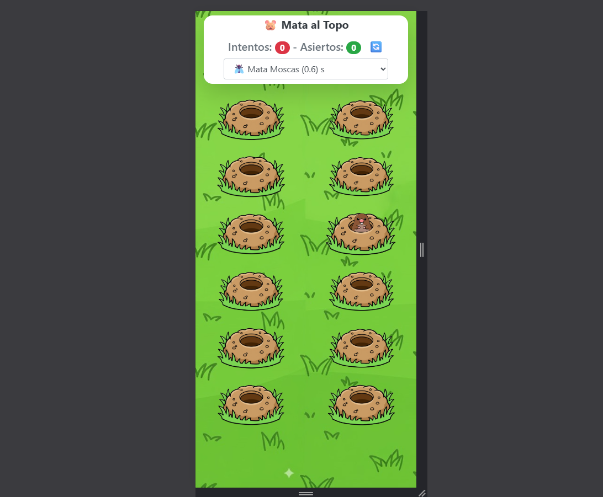

# Game Mole 🐹

**Game Mole** es un divertido juego de "golpear al topo" desarrollado con **Vue 3** y **Vite**.  
El juego incluye niveles de dificultad, puntajes de aciertos y fallos, y música de fondo.

---

## Demo en Vivo

Puedes probar el juego en tu navegador en:  
[https://bryancometa-soft.github.io/game-mole/](https://bryancometa-soft.github.io/game-mole/)

---

## Capturas del juego

| Desktop | Móvil |
|---------|-------|
|  |  |

---

## Características

- Juego interactivo estilo "Whac-a-Mole".
- Niveles de dificultad:
  - ⚡️ Dios del Olimpo → 150 ms
  - 🛡️ Guerrero Espartano → 300 ms
  - 🪰 Mata Moscas → 600 ms
  - 🦆 Cazador de Patos → 1000 ms
  - 🦋 Mata Mariposas → 1500 ms
  - 👑 Eres una Princesa → 2000 ms
- Guarda el nivel seleccionado en **Local Storage**.
- Música de fondo que se activa al primer clic del usuario.
- Contador de aciertos y fallos.
- Animaciones CSS para los topos y el martillo.

---

## Requisitos

- Node.js `^20.19.0 || >=22.12.0`
- npm (v8+ recomendado)
- Navegador moderno (Chrome, Edge, Firefox, Safari)

---

## Instalación

1. Clona el repositorio:

```bash
git clone https://github.com/BryanCometa-SOFT/game-mole.git
cd game-mole

Instala las dependencias:

npm install


Comandos de desarrollo

Inicia el servidor local con Hot Reload:

npm run dev

Compila y minifica para producción:

npm run build

Estructura del proyecto

game-mole/
├─ public/                # Archivos estáticos
├─ src/                   # Código fuente
│  ├─ assets/             # Imágenes, sonidos, iconos
│  ├─ components/         # Componentes Vue
│  └─ App.vue             # Componente principal
├─ docs/                  # Carpeta usada para GitHub Pages
├─ package.json
└─ vite.config.js

```

Créditos

Desarrollado por Bryan Cometa

Música y assets libres de derechos o propios.
